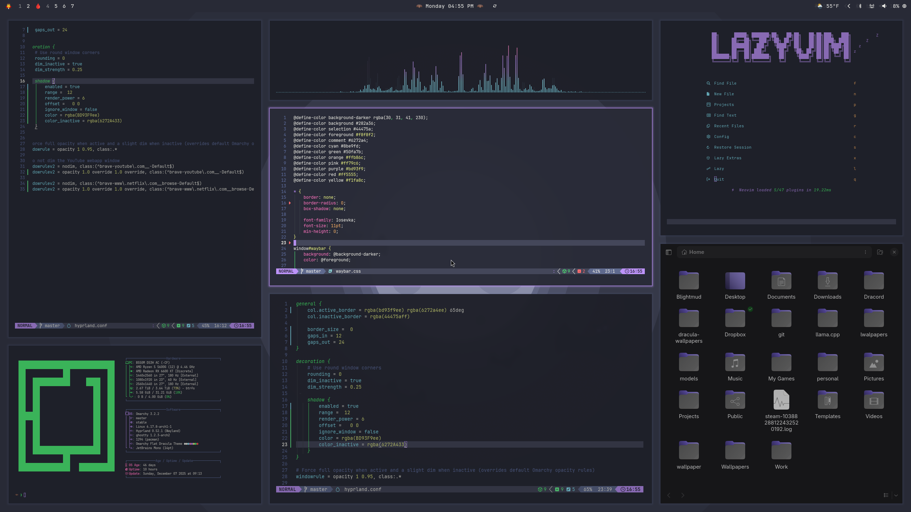

# Omarchy Flat OneDark Theme

Stock-safe Omarchy theme with a flat One Dark identity, rebuilt around semantic tokens, a stock-first Waybar, a cleaner Walker surface, and a richer two-line prompt.



## What's included
- Semantic tokens in `theme.tokens.sh`
- Generated repo-owned artifacts for Walker, Hyprland and app integrations, with a stock-first Waybar color layer
- Template-driven colors for terminal, Hyprlock, SwayOSD, btop, browser policy and other Omarchy surfaces via `colors.toml`
- Stock-aligned Waybar layout in `waybar-theme/config.jsonc`
- Future-facing `qbar.css` contract file for qbar to consume later
- Segmented `starship.toml` with smart path truncation and Python env visibility
- `scripts/apply-theme.sh` to sync this project into Omarchy and apply it safely
- `scripts/audit-theme.sh` to detect files that accidentally shadow Omarchy templates

## Theme Editing (Single Source of Truth)

Edit only:

```bash
theme.tokens.sh
```

Then regenerate every theme file:

```bash
./scripts/build-theme.sh
```

This rewrites the generated repo-owned files from one palette and one density/typography layer.

Run the audit whenever you change file ownership across the theme:

```bash
./scripts/audit-theme.sh
```

If the audit fails, the repo is shadowing an Omarchy template that should probably be generated from `colors.toml` instead.

## Apply To Omarchy

Stock-safe apply:

```bash
./scripts/apply-theme.sh
```

Preview the system changes without touching `~/.config`:

```bash
./scripts/apply-theme.sh --dry-run
```

The apply script:
- rebuilds the generated artifacts;
- syncs the repo to `~/.config/omarchy/themes/flat-onedark`;
- backs up the live Waybar and Starship configs before overwrite;
- applies the theme with `omarchy-theme-set flat-onedark`;
- restarts Walker after theme application so the launcher picks up the new CSS.

The repo remains the source of truth. `theme-manager` can still be useful for inspection, but this theme should not require a post-apply repair step through `theme-manager`.

## Tool Color Map (Quick)

| Tool | Runtime path used by Omarchy | File in this theme repo | Apply/Reload |
| --- | --- | --- | --- |
| Waybar style | `~/.config/waybar/style.css` imports `~/.config/omarchy/current/theme/waybar.css` | `waybar.css`, `waybar-theme/style.css` | `omarchy-restart-waybar` |
| Waybar layout | `~/.config/waybar/config.jsonc` | `waybar-theme/config.jsonc` | `omarchy-restart-waybar` |
| qbar theme contract | `~/.config/omarchy/current/theme/qbar.css` | `qbar.css` | qbar-side integration only |
| Walker | `~/.local/share/omarchy/default/walker/themes/omarchy-default/style.css` imports `~/.config/omarchy/current/theme/walker.css` | `walker.css` | `omarchy-restart-walker` |
| Hyprland look | `~/.config/hypr/hyprland.conf` sources `~/.config/omarchy/current/theme/hyprland.conf` | `hyprland.conf` | `hyprctl reload` |
| Hyprlock | `~/.config/hypr/hyprlock.conf` sources `~/.config/omarchy/current/theme/hyprlock.conf` | generated from `colors.toml` templates | `hyprctl reload` |
| Mako | `~/.config/mako/config` symlink to `~/.config/omarchy/current/theme/mako.ini` | generated from `colors.toml` templates | `omarchy-restart-mako` |
| SwayOSD | `~/.config/swayosd/style.css` imports `~/.config/omarchy/current/theme/swayosd.css` | generated from `colors.toml` templates | `omarchy-restart-swayosd` |
| Alacritty | `~/.config/alacritty/alacritty.toml` imports current theme | generated from `colors.toml` templates | `omarchy-restart-terminal` |
| Kitty | `~/.config/kitty/kitty.conf` includes current theme | generated from `colors.toml` templates | `omarchy-restart-terminal` |
| Ghostty | `~/.config/ghostty/config` loads current theme | generated from `colors.toml` templates | `omarchy-restart-terminal` |
| Browser color policy | `omarchy-theme-set-browser` reads `~/.config/omarchy/current/theme/chromium.theme` | generated from `colors.toml` templates | `omarchy-theme-set` |
| VSCode/Codium/Cursor theme | `omarchy-theme-set-vscode` reads `~/.config/omarchy/current/theme/vscode.json` | `vscode.json` | `omarchy-theme-set` |
| Obsidian theme sync | `omarchy-theme-set-obsidian` copies `~/.config/omarchy/current/theme/obsidian.css` to vaults | generated from `colors.toml` templates | `omarchy-theme-set` |
| Keyboard RGB | `omarchy-theme-set-keyboard-*` reads `~/.config/omarchy/current/theme/keyboard.rgb` | generated from `colors.toml` templates | `omarchy-theme-set` |
| btop | `~/.config/btop/themes/current.theme` symlink to current theme | generated from `colors.toml` templates | `omarchy-restart-btop` |
| Neovim | `~/.config/nvim/lua/plugins/theme.lua` symlink to current theme | `neovim.lua` | Restart nvim |
| Starship prompt | `~/.config/starship.toml` | `starship.toml` | new shell |

## Waybar Layouts

The default layout in this repo is aligned with the current Omarchy stock contract:
- workspaces on the left;
- clock and indicators in the center;
- tray/audio/network/power on the right;
- no hard dependency on qbar.

If you want qbar in the bar, let qbar own that setup:

```bash
qbar setup
```

This theme now only publishes `qbar.css` as a future-facing visual contract. It does not copy qbar icons, inject qbar modules, or style qbar providers inside the main Waybar apply flow.

Waybar itself is now intentionally minimal:
- stock Omarchy layout;
- stock Omarchy wrapper CSS;
- theme-owned `waybar.css` reduced to foreground/background only.

To return to Omarchy defaults outside this repo:

```bash
omarchy-refresh-waybar
```

## Solid Windows (No Transparency)

- Global window opacity is controlled in `hyprland.conf`.
- Generated rules keep all window opacity values at `1.0`.
- Ghostty also uses `background-opacity = 1.0`.

## Installation

```bash
omarchy-theme-install https://github.com/<seu-user>/omarchy-flat-onedark-theme
```

Apply theme:

```bash
omarchy-theme-set flat-onedark
```

## Detailed Guide

For full mapping, template flow, troubleshooting, and reset commands, see:

- `docs/theme-color-map.md`

## Practical Theme Policy

This repo uses a hybrid model on purpose:

- `colors.toml` owns surfaces where Omarchy already provides good templates and the main risk is palette drift.
- Direct repo files own surfaces where this theme needs layout or interaction control beyond the stock templates.

That split matters for UX:

- `wifi`, `bluetooth`, `audio` and `processes` launched from Waybar are terminal TUIs, so their readability is driven mostly by terminal ANSI colors.
- `power`, setup menus and Omarchy action menus go through Walker, so those are controlled by `walker.css`.

If a surface looks wrong after apply, first check whether it should be template-driven or repo-owned before adding more hardcoded overrides.

## Backgrounds
This theme ships with the One Dark backgrounds:
- `bg1.jpg`
- `bg2.png`
- `bg3.jpg`

## Credits
- Flat structure/source project: https://github.com/OldJobobo/omarchy-flat-dracula-theme
- One Dark Pro palette/source project: https://github.com/sc0ttman/omarchy-one-dark-pro-theme
